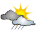
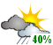
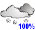
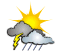
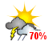

## Environment Canada forecast script (for weather.gc.ca)

This script is along the lines of the carterlake.org NOAA 5-day script especially for the Canadian stations using Environment Canada as the source of the data. It uses a new set of customized icons with PoP displayed like the www.crh.noaa.gov website used by Tom's script. Examples:

<table cellspacing="3" cellpadding="2" border="0">
<tbody>
<tr>
<td>Partly Cloudy</td>
<td>PoP: 40% ==></td>
<td>Partly Cloudy</td>
</tr>
<tr>
<td>Rain and snow</td>
<td>PoP: 100% ==></td>
<td>Rain and snow</td>
</tr>
<tr>
<td>Thunderstorm</td>
<td>PoP: 70% ==></td>
<td>Thunderstorm</td>
</tr>
</tbody>
</table>

The scripts and GIF icons are included in the distribution. The script also requires the URL for the printable forecast for your area. Instructions are included with the source file and the [**ec-forecast-README.txt**(ec-forecast-README.txt) for the script.

As of V2.16, ec-forecast.php now supports the new transparent PNG icons created by [Thayer Fox(http://foxed.ca/) who has kindly permitted distribution from this site.  
As of V3.00, the ZIP version contains these PNG icons.

<table style="border:none;background-color: #CCC" cellspacing="3" cellpadding="2">
<tbody>
<tr>
<td>Partly Cloudy</td>
<td>PoP: 40% ==></td>
<td>Partly Cloudy</td>
</tr>
<tr>
<td>Rain and snow</td>
<td>PoP: 100% ==></td>
<td>Rain and snow</td>
</tr>
<tr>
<td>Thunderstorm</td>
<td>PoP: 70% ==></td>
<td>Thunderstorm</td>
</tr>
</tbody>
</table>

Configure the ec-forecast.php to use the .png images in the settings area.

The script supports both **English** and **French** languages via the **lang=en** or **lang=fr** parameter. A live example of the French version (with lang=fr) is shown below.

With Version 1.08, a new _$currentConditions_ string is formatted with the current conditions of the selected city. If the city's conditions are based on a nearby airport, then a current conditions icon and short weather description are included. You can enable automatic printout by using _$showConditions = true;_ in the ec-forecast.php script which will cause it to print before the alerts and forecast section. If you're 'quitely' including the script on your page, you can still _print $currentConditions;_ where you'd like the conditions display to appear.

Version 2.00 brings a major rewrite of the script to accomodate a major change in the EC Forecast pages. Included with the .ZIP distribution are the new icons now in use by EC for the forecast site. The V2.00 script is compatible with the prior icon set distributed with the Version 1.nn script.

Version 2.16 included multi-forecast capability, improved diagnostics, support for the new transparent PNG icons, and additional settings for display of date with icon and/or detail forecast legend.

Version 3.00 is a major rewrite to support the EC website changes in October, 2014\. The .zip distribution now includes the current .PNG format weather icons with POP stamps.

Version 3.02 has a major change in display of the temperature forecasts with the icons. It is now done by an extract of the value from the detail text forecast instead of the old method of using the values from the icon HTML. This should provide a more consistent presentation of Min/Max values for the icons.  

Version 4.02 now uses cURL functions and uses HTTPS to access the EC website.

Version 5.00 is a major rewrite of the script to use the EC XML data instead of page scraping the EC website. V5.00 includes an Almanac and a 24-hour rolling forecast that can be displayed via new settings (default is to display both). The XML parsing should insulate us from further tweaks with the EC website page design as the XML format is unchanged for many years.

Version 6.00 is a major rewrite of the script to use EC JSON data from the new EC website design.  The script accomodates either old format or new format URLs for forecast selection.
All new forecast site selections need to use the new URL format with latitude,longitude.

Using it on a PHP page:

```
<?PHP
$doInclude = true;
include_once("ec-forecast.php");
?>
```

You can suppress all visible printing by using ```$doPrint = false;``` before doing the include.

The program will return with bits of the forecast items in various
PHP variables:
With V4.00 and an EC site redesign, the EC now returns 12hour forecast periods
 ```$i``` = 0 to 11  with 0=now, 1=next period, 2=period+2, 3=period+3, 4=period+4 (etc.)

```$forecasttitles[$i]``` = Day/night day of week for forecast

```$forecasticon[$i]``` =  statement for forecast icon

```$forecasttemp[$i]``` = Red Hi, Blue Lo temperature(s)

```$forecasttext[$i]``` = Summary of forecast for icon

```$forecastdays[$n]``` = Day/night day of week for detail forecast

```$forecastdetail[$n]``` = detailed forecast text

Also returned are these useful variables filled in:
```$title``` = updated/issued text in language selected

```$textfcsthead``` = 'Current Forecast' or 'Textes des pr?visions'

```$weather``` = fully formed html table with two rows of Icons and text

```$textforecast``` = fully formed <div> with text forecast as <dl>

```$alertstring``` = styled HTML to display bars with dropdown details for active advisories/warnings

```$currentConditions``` = table with current conditions at EC forecast site

```$almanac``` = styled box with Average/Extreme data for the EC forecast site (V5.00)

```$forecast24h``` = styled table with rolling 24hr forecast details (V5.00)

you can set ```$printIT = false;``` and just echo/print the variables above in your page to precisely position them.  Or use ```$forecast[$i]``` to print just one of the items where you need it.

 I'd recommend you NOT change any of the main code.  You can do styling  for the results by using CSS.  See the companion test page
 ec-forecast-testpage.php to demonstrate CSS styling of results.

You can also access the 'maxmin' for the location (where available on the EC site) by using

```
<?php  
print "For this date:<br/>\n";  
print $conditions['maxmin'] . "<br/>\n";  
?>
```

which would show:

```
For this date:  
Normals: Max 16°C Min 5°C
```

# Sample of the output for lang=fr (French):


# Sample expanded alert for lang=fr (French):

